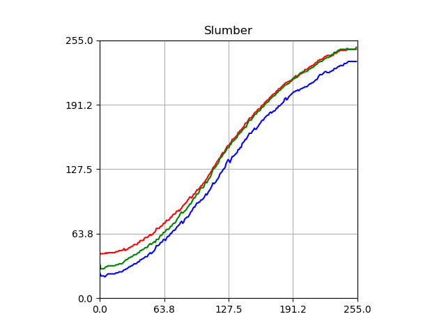
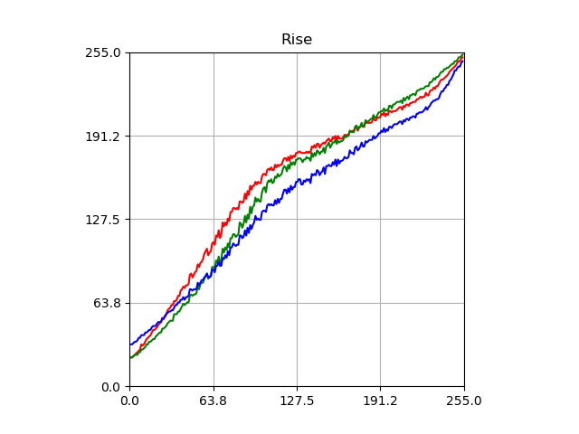
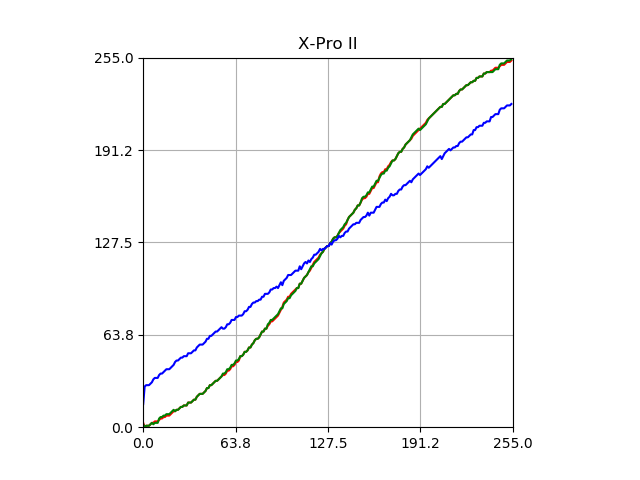
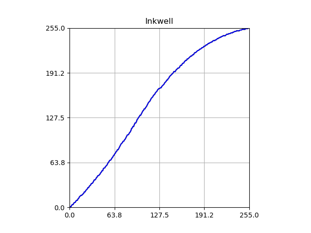
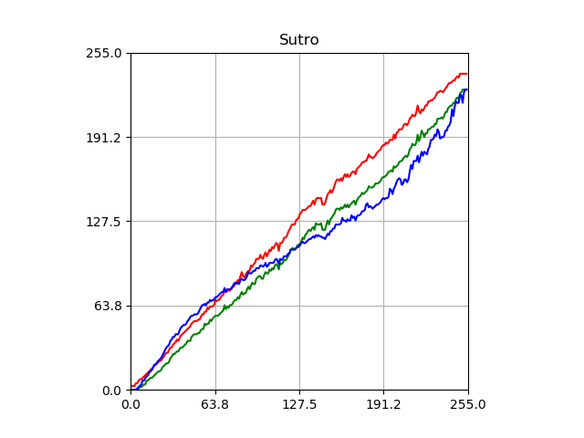
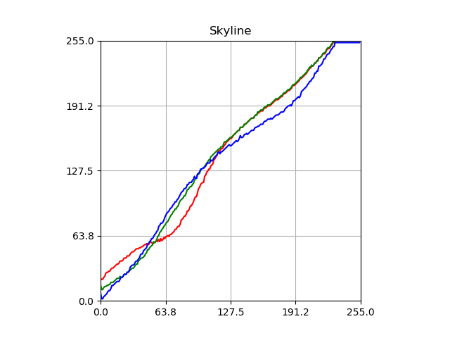
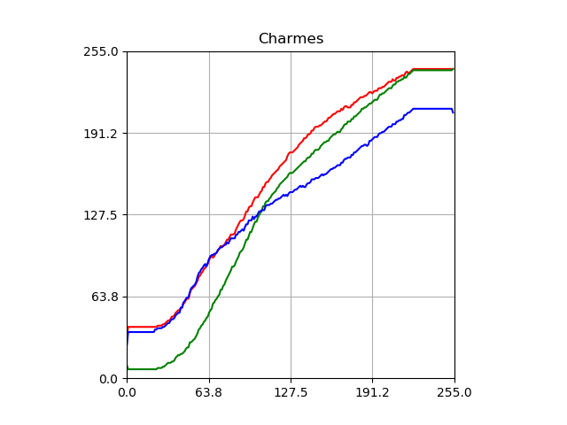

# Instagram Filter RGB Curves

This project tries to figure out the RGB curves of the Instagram filters.
### Clarendon

### Gingham

### Moon

### Lark

### Reyes

### Juno

### Slumber

### Crema

### Ludwig

### Aden

### Perpetua

### Amaro

### Mayfair

### Rise

### Hudson

### Valencia

### X-Pro II

### Sierra

### Willow

### Lo-Fi

### Inkwell

### Hefe

### Nashville

### Stinson

### Vesper

### Earlybird

### Brannan

### Sutro

### Toaster

### Walden

### 1977

### Kelvin

### Maven

### Ginza

### Skyline

### Dogpatch

### Brooklyn

### Helena

### Ashby

### Charmes
